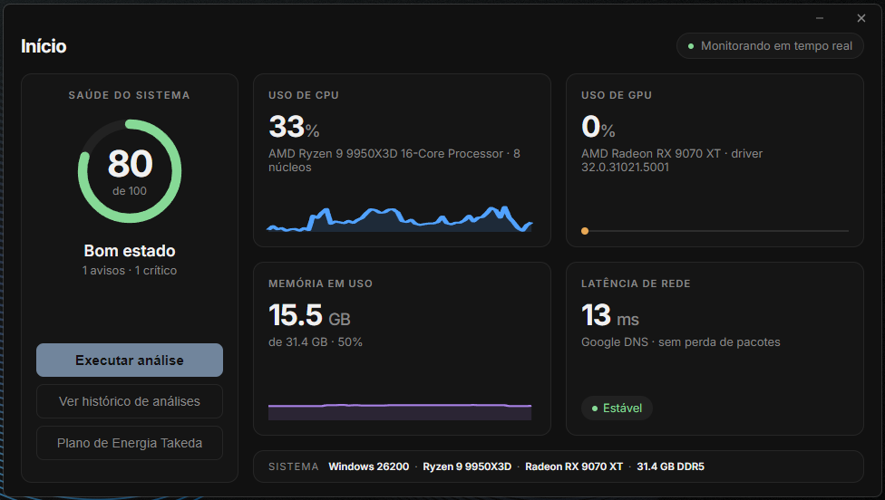
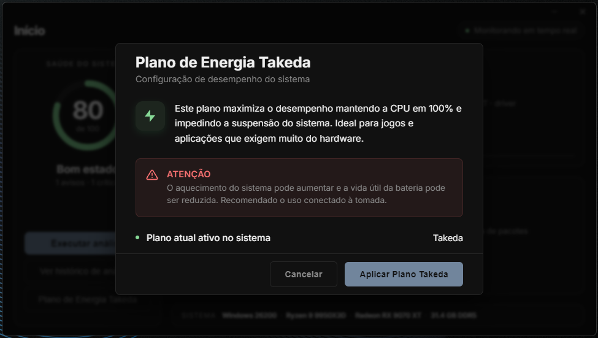
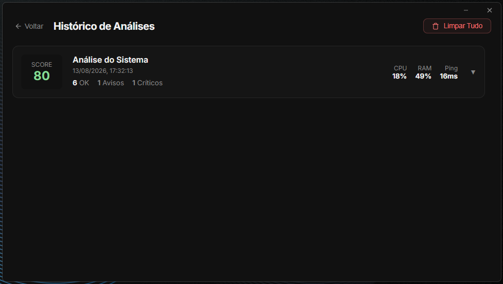

<div align="center">
  
  <h1>Takeda App</h1>
  <p><strong>Análise, Limpeza e Otimização do Sistema — Tudo em um só lugar.</strong></p>

  <p>
    
    
    
    
    
  </p>

  <p>
    <a href="https://github.com/hugotakeda/Takeda-App/releases/latest">
      
    </a>
  </p>
</div>

---

## 📋 Sobre

O **Takeda App** é um aplicativo desktop para Windows que oferece um painel completo de monitoramento, diagnóstico, limpeza e otimização do seu sistema operacional. Desenvolvido com **Electron**, ele combina uma interface moderna e elegante (dark mode) com ferramentas poderosas de nível nativo via PowerShell e WMI.

O acesso é protegido por **autenticação via Discord OAuth2**, com verificação de licença baseada em **HWID** (Hardware ID), garantindo segurança e controle de acesso.

---

## ✨ Funcionalidades

### 🩺 Diagnóstico Completo
> Análise detalhada de 8 pontos do sistema com score de saúde de 0–100.

- Uso de CPU e RAM em tempo real com gráficos sparkline
- Verificação do plano de energia ativo
- Status do driver da GPU e idade do driver
- Contagem de apps pesadas em segundo plano
- Status do Windows Defender (tempo real)
- Latência de rede (ping ao Google DNS 8.8.8.8)
- Tipo e velocidade do adaptador de rede

### 🧹 Limpeza Inteligente
> Remoção segura de arquivos desnecessários com prévia de tamanho por categoria.

| Categoria | Descrição |
|---|---|
| Temporários (Usuário) | `%TEMP%` — cache de instaladores e apps |
| Temporários (Windows) | `C:\Windows\Temp` |
| Prefetch | Cache de inicialização do Windows |
| Crash Dumps | Memory dumps de programas que travaram |
| Cache de Miniaturas | `thumbcache_*.db` do Explorer |
| Lixeira | Todo conteúdo da Lixeira do Windows |

### ⚡ Plano de Energia Takeda
> Perfil de energia personalizado para máximo desempenho em jogos e aplicações pesadas.

Importa e aplica automaticamente o arquivo `takeda.pow`, um plano de energia otimizado para extrair a melhor performance do hardware — ideal para gaming e produtividade intensiva.

### 🔧 Tweaks do Sistema
> Ajustes avançados de sistema para otimização extra.

Aplique tweaks de registro e configuração do Windows com um clique, todos reversíveis. Cada tweak mostra seu status atual (ativo/inativo) em tempo real.

### 📊 Monitoramento ao Vivo
> Dashboard com dados em tempo real atualizados a cada 1 segundo.

- **CPU** — uso percentual + gráfico sparkline com histórico de 60 amostras
- **GPU** — uso percentual + barra de progresso animada
- **RAM** — uso em GB + gráfico sparkline
- **Ping** — latência em ms + indicador de estabilidade (Estável/Instável/Offline)
- **Info do Sistema** — OS build, modelo da CPU, GPU e quantidade de RAM

### 📜 Histórico de Análises
> Registro automático de todos os diagnósticos realizados.

Cada análise é salva com timestamp e score, permitindo acompanhar a evolução da saúde do sistema ao longo do tempo.

### 🔐 Autenticação Segura
> Login via Discord com verificação de licença por HWID.

- OAuth2 com flow seguro via loopback HTTP local
- Validação de licença contra backend (`Lumem-Backend`)
- Sessão persistida localmente com DPAPI (Windows Credential Manager)
- Hardware ID único por máquina (`node-machine-id`)

---

## 📸 Screenshots

<div align="center">

### Dashboard Principal


### Plano de Energia Takeda


### Histórico de Análises


</div>

---

## 🏗️ Arquitetura

```
Takeda App/
├── electron/                 # Processo principal (Node.js)
│   ├── main.js               # Entry point — janela, IPC handlers
│   ├── preload.js             # Bridge segura (contextBridge)
│   ├── auth/                  # Autenticação Discord OAuth2
│   │   ├── hwid.js            # Hardware ID via node-machine-id
│   │   ├── oauth-server.js    # Servidor HTTP loopback para callback
│   │   ├── secure-store.js    # Persistência segura de sessão
│   │   └── shared-config.js   # Configurações compartilhadas
│   └── services/              # Serviços nativos (PowerShell/WMI)
│       ├── diagnostic.js      # Diagnóstico completo do sistema
│       ├── monitor.js         # Monitoramento em tempo real
│       ├── cleanup.js         # Limpeza de arquivos
│       ├── powerplan.js       # Gerenciamento de planos de energia
│       ├── history.js         # Persistência do histórico
│       └── tweaks.js          # Tweaks do sistema
├── src/                       # Processo renderer (UI)
│   ├── index.html             # HTML principal
│   ├── index.css              # Estilos (dark mode customizado)
│   ├── app.js                 # Lógica principal da UI
│   ├── auth.js                # Fluxo de autenticação no renderer
│   ├── api.js                 # Comunicação com o backend
│   ├── config.js              # Configurações do app
│   ├── i18n.js                # Internacionalização
│   ├── pages/                 # Páginas da aplicação
│   │   ├── Login.js           # Tela de login com Discord
│   │   ├── History.js         # Histórico de análises
│   │   └── Tweaks.js          # Painel de tweaks
│   ├── components/            # Componentes reutilizáveis
│   └── locales/               # Arquivos de tradução
└── assets/                    # Recursos estáticos
    ├── takeda.pow             # Plano de energia customizado
    ├── takeda-icon-*.png      # Ícones em múltiplas resoluções
    └── *.png                  # Screenshots e backgrounds
```

---

## 💻 Rodando Localmente

### Pré-requisitos

- [Node.js](https://nodejs.org/) v18+ instalado
- Windows 10/11
- Conta no Discord (para autenticação)

### Instalação

```bash
# 1. Clone o repositório
git clone https://github.com/hugotakeda/Takeda-App.git
cd Takeda-App

# 2. Instale as dependências
npm install

# 3. Inicie em modo de desenvolvimento
npm run dev
```

### Build

```bash
# Gerar o executável portátil (.exe)
npm run build

# Gerar apenas o diretório descompactado (para debug)
npm run pack
```

O arquivo final será gerado na pasta `dist/`.

---

## 🛠️ Tecnologias

| Tecnologia | Uso |
|---|---|
| **[Electron](https://www.electronjs.org/)** | Framework desktop — processo main + renderer |
| **JavaScript / Node.js** | Lógica nativa, IPC, serviços de sistema |
| **HTML5 / CSS3** | Interface dark mode responsiva e customizada |
| **PowerShell / WMI** | Coleta de métricas e execução de comandos nativos |
| **Discord OAuth2** | Autenticação segura via navegador |
| **node-machine-id** | Identificação única de hardware (HWID) |
| **electron-builder** | Empacotamento e distribuição (portable .exe) |

---

## 📄 Licença

Este projeto está licenciado sob a [MIT License](LICENSE).

